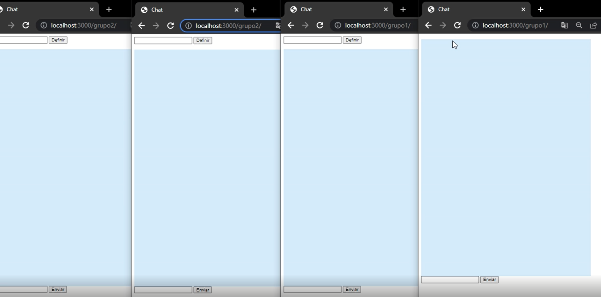

# Chat Socket IO

## Desenvolvido por: Roni Athayde

### *01/09/2022*

> Projeto desenvolvido para práticar os conhecimentos estudados de node utilizando a ferramenta Socket IO

---

### Visualização

--- 

*Para executar o projeto é necessário que execute o seguinte comando no seu terminal: *

`node index.js`

Depois é preciso que no navegador de sua preferencia digite as URLs:

localhost:3000/grupo1

localhost:3000/grupo2

**OU**

Você pode clicar nas URLs caso já tenha o projeto localmente:

<a href="localhost:3000/grupo1" target="_blank">Entrar no grupo 1</a>  
http://localhost:3000/grupo1

ou

<a href="localhost:3000/grupo2" target="_blank">Entrar no grupo 2</a>
http://localhost:3000/grupo2

---

## Tecnologias utilizadas

* HTML
* CSS
* JAVASCRIPT
* NODE
* EXPRESS
* SOCKET IO
